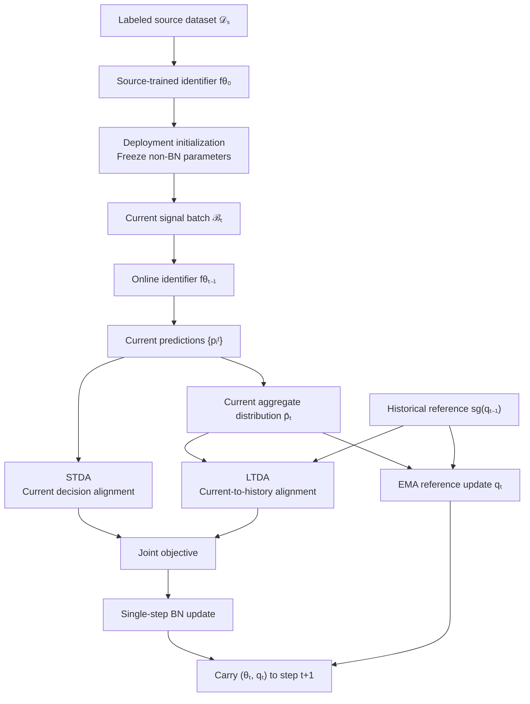

# SLPA-SEI 整体框架图修改建议

本文档针对当前完整手绘框架图，从内容逻辑、英文文字和视觉设计三个方面进行审查。修改时应以最终算法为准：SLPA-SEI 只包含 Short-Term Decision Alignment（STDA）与 Long-Term Distribution Alignment（LTDA）；STDA 为 CE−ME，LTDA 为当前平均预测分布与历史参考之间的 JS 对齐，在线阶段仅执行一次 BN 参数更新，并保存紧凑的历史预测分布参考。

## 一、总体结论

当前图已经具备“源域训练—模型迁移—在线适应—进入下一时刻”的整体结构，通信场景也能够被识别出来。但“不够好看”的根本原因并不只是配色，而是以下三类问题叠加：

1. **核心方法没有成为视觉中心。** 通用的源域训练流程和多个神经网络图标占据了较大面积，而真正体现论文创新的 STDA、LTDA 与联合更新被压缩在底部。
2. **算法闭环不够清楚。** 当前批次、预测结果、两个模块、联合损失、BN 更新以及历史参考传递之间的箭头没有构成一条明确的时间链。
3. **图形语义与当前算法存在冲突。** STDA 被画成伪标签传播与特征聚类，LTDA 被画成历史原型与当前原型匹配，这两种理解都不是最终算法。
4. **视觉语言不统一。** 图中同时使用粗块箭头、细线箭头、手写字体、衬线字体、无衬线字体、虚线边框以及多种背景色，造成明显的拼贴感。

因此，不建议只调整颜色或移动几个元素。更有效的方案是保留现有的上下两区结构，但重新组织信息层级和连接关系，使主线变成：

> 源域训练得到初始识别器 → 当前无标签信号到达 → 产生当前预测 → STDA 与 LTDA 构造联合目标 → 单步 BN 更新 → 同时传递更新后的模型参数与历史参考至下一步。

## 二、内容与算法逻辑

### 2.1 源域训练部分

当前上方流程为：

`Labeled RF Signals → Source Domain Dataset → Pre-Trained Model → Parameter Freezing`

该流程存在两个问题。

第一，`Labeled RF Signals` 与 `Source Domain Dataset` 在视觉功能上重复。二者都在说明监督源数据，可以合并成一个节点：

`Labeled source dataset $\mathcal D_s$`

节点内部保留信号波形和标签符号即可，不需要再额外使用大型数据库圆柱。

第二，`Parameter Freezing` 不应作为训练后产生的另一个模型。它是部署阶段的参数配置，而不是一种新的网络状态。建议将顶部简化为：

`Labeled source dataset $\mathcal D_s$ → Source training → Source-trained identifier $f_{\theta_0}$`

在模型向在线阶段迁移的箭头旁标注：

`Freeze $\theta^{\mathrm{fix}}$; adapt $\theta^{\mathrm{BN}}$ only`

这样可以明确区分：

- 非 BN 参数始终冻结；
- 只有允许适应的 BN 参数参与在线梯度更新；
- 历史参考 $\mathbf q_t$ 不是模型参数。

当前图中“上方模型加闭锁、下方模型加开锁”的表达容易让人误解为在线阶段整个网络被解冻，必须修改。建议把网络中的普通层统一画成浅灰色，仅把 BN 层或 BN 参数标成蓝色，并在旁边写 `BN-only update`。

### 2.2 部署与 source-free 边界

当前 `Model Transfer` 曲线较大，而且像是双向传递。实际过程是源训练完成后，用 $f_{\theta_0}$ 单向初始化在线识别器。

建议改成一条简洁的单向箭头，并标注：

- `Deployment initialization`，或
- `Initialize online identifier`。

在上下区域分界附近增加一条小号说明：

`Source signals are unavailable during online adaptation`

这比反复写 `source-free` 更直观，也能说明只有模型参数被带入部署阶段，源域数据不会进入 STDA 或 LTDA。

### 2.3 在线主流程

当前下方主流程为：

`Emitters → Receiver → Real World RF Signals → Current batch → Model → Predict → Updated model`

它大体方向正确，但 `Predict` 只是一个动词框，且没有明确说明预测结果如何进入两个模块。建议重构为：

1. 注册发射机产生信号；
2. 接收机获得时变无线条件下的无标签信号；
3. 当前信号集合记为 $\mathcal B_t$；
4. 在线识别器 $f_{\theta_{t-1}}$ 产生预测 $\{\mathbf p_i^t\}_{i=1}^{N_t}$；
5. 当前预测同时进入 STDA，并通过平均得到 $\overline{\mathbf p}_t$ 后进入 LTDA；
6. 两个模块形成联合目标；
7. 对允许适应的 BN 参数执行一次更新，得到 $\theta_t$；
8. 保存 $\mathbf q_t$，并把 $(\theta_t,\mathbf q_t)$ 传递至下一步。

主线推荐写成：

`Incoming unlabeled RF signals → Current signal batch $\mathcal B_t$ → Online identifier $f_{\theta_{t-1}}$ → Current predictions $\{\mathbf p_i^t\}$`

不要用数据库圆柱表示 `Current batch`。圆柱容易暗示长期存储的数据集，与“连续到达、每个批次只处理一次”的设定相冲突。可以改成三张叠放的信号卡片，或者一组横向排列的短波形。

### 2.4 预测与更新顺序

当前图看起来采用 `predict-then-update`：先用 $\theta_{t-1}$ 得到当前预测，再构造损失并更新到 $\theta_t$。如果最终代码采用该预序评估方式，图中应明确显示：

`Predict with $\theta_{t-1}$ → compute losses → one-step BN update → obtain $\theta_t$`

如果代码实际采用适应后再计分，则必须同步修改箭头顺序。最终定稿前应再次核对代码中的计分时机，不能只根据当前草图锁定协议。

### 2.5 STDA 内容

STDA 的输入应来自当前预测，而不是直接来自原始批次。其目标为

$$
\mathcal L_{\mathrm{STDA}}^t
=
\mathcal H_{\mathrm{CE}}^t
-
\mathcal H_{\mathrm{ME}}^t.
$$

当前图中的 `Pseudo-label propagation` 与 `Compact clusters` 必须删除，原因如下：

- 最终算法中不存在伪标签传播步骤；
- CE−ME 不直接优化特征空间类簇；
- 紧凑类簇和斜向决策边界会构成未经验证的表征几何声明。

建议将 STDA 改成一个输入、两个并行作用、一个联合目标：

```text
Current predictions {p_i^t}
        ├── Conditional entropy ── Per-signal decisiveness
        └── Marginal entropy ───── Aggregate non-concentration
                              ↓
                         L_STDA^t
```

图形上可以使用小型概率条形图：条件熵分支表示单个预测由模糊变得明确；边缘熵分支表示当前集合的平均预测不再过度集中于少数类别。不要把平均分布画成严格均匀，因为均匀参考只是软性的 anti-collapse 解释，不是真实发射机活动先验。

### 2.6 LTDA 内容

LTDA 应比较完整的当前平均预测分布和历史参考：

$$
\mathcal L_{\mathrm{LTDA}}^t
=
D_{\mathrm{JS}}
\left(
\overline{\mathbf p}_t
\middle\|
\operatorname{sg}(\mathbf q_{t-1})
\right).
$$

当前图中的 `History memory`、堆叠卡片、`Current prototypes` 和逐类虚线匹配容易造成以下误解：

- 使用 memory bank 保存多个历史批次；
- 回放历史原始信号；
- 进行类别原型的一一匹配。

实际只保存一个 $C$ 维历史预测分布参考 $\mathbf q_{t-1}$。建议使用两组概率条形图，并在中间放置 `JS alignment`：

```text
Historical reference sg(q_{t-1}) ─┐
                                   ├── JS alignment ── L_LTDA^t
Current aggregate distribution p̄_t ─┘
```

在 JS 对齐完成后，再单独画出 EMA 参考更新：

$$
\mathbf q_t
=
\mu\mathbf q_{t-1}
+
(1-\mu)\operatorname{sg}(\overline{\mathbf p}_t).
$$

必须表现“先构造当前对齐目标，再写入新参考”的顺序。历史参考使用虚线或停止符号表示 stop-gradient，当前平均分布仍保持可微。

### 2.7 联合目标与单步更新

当前右下角 `Joint loss` 太小、距离两个模块过远，且反馈箭头横跨整张图。建议把联合目标放在 STDA 和 LTDA 的右侧中央，使两个模块的输出自然汇合：

$$
\mathcal L_{\mathrm{SLPA\text{-}SEI}}^t
=
\mathcal L_{\mathrm{STDA}}^t
+
\lambda_{\mathrm{mec}}\mathcal L_{\mathrm{LTDA}}^t.
$$

联合目标之后连接一个明确的操作节点：

`Single-step BN update`

再由该节点输出：

`Updated identifier $f_{\theta_t}$`

当前图中只写 $\lambda$，建议改为与正文和代码一致的 $\lambda_{\mathrm{mec}}$。不要新增 $\lambda_{\mathrm{ME}}$、门限或其他图中参数。

### 2.8 下一时刻的状态传递

当前 `to time $t+1$` 只接在更新模型后面，会遗漏 LTDA 的历史参考。正确表达应为：

`Carry $(\theta_t,\mathbf q_t)$ to adaptation step $t+1$`

可以在最右侧使用一个小型状态框，将模型参数和历史参考一起包围，再用粗蓝色箭头指向省略号。这样能够闭合双时间尺度在线更新，而不是只表现模型参数的迭代。

## 三、文字与符号修改

### 3.1 建议替换表

| 当前文字 | 建议文字 | 修改理由 |
|---|---|---|
| `Source Domain Training` | `Source Training` | 更简洁，domain 已由 $\mathcal D_s$ 表明 |
| `Labeled RF Signals` | `Labeled source RF signals` | 明确属于源条件 |
| `Source Domain Dataset D_S` | `Source dataset $\mathcal D_s$` | 统一数学字体与下标 |
| `Pre-Trained Model fθ` | `Source-trained identifier $f_{\theta_0}$` | 比 model 更符合 SEI 任务语义 |
| `Parameter Freezing` | `Freeze non-BN parameters` | 说明冻结范围，避免理解成全部冻结 |
| `Model Transfer` | `Deployment initialization` | 强调单向初始化而非双向迁移 |
| `Test-Time Adaptation` | `Online Test-Time Adaptation` | 突出论文的连续在线设定 |
| `Emitter K` | `Emitter C` | 与正文中 $C$ 个注册发射机保持一致 |
| `Real World RF Signals` | `Incoming unlabeled RF signals` | 更准确体现在线无标签输入 |
| `Current batch B_t` | `Current signal batch $\mathcal B_t$` | 避免与长期数据集混淆 |
| `Model $f_{\theta_{t-1}}$` | `Online identifier $f_{\theta_{t-1}}$` | 符合通信领域表达 |
| `Predict` | `Current predictions $\{\mathbf p_i^t\}$` | 明确模块实际接收的量 |
| `Updated model $f_{\theta_t}$` | `Updated identifier $f_{\theta_t}$` | 与 source-trained identifier 对应 |
| `to time $t+1$` | `Carry $(\theta_t,\mathbf q_t)$ to step $t+1$` | 同时传递模型与历史参考 |
| `Current-batch refinement` | `Current-set decision alignment` | 与 STDA 的真实作用一致 |
| `Pseudo-label propagation` | `Per-signal decisiveness (CE)` | 删除不存在的伪标签机制 |
| `Compact clusters` | `Aggregate non-concentration (ME)` 或直接显示 $\mathcal L_{\mathrm{STDA}}^t$ | 避免无依据的聚类声明 |
| `History-anchored update` | `Current-to-history distribution alignment` | 准确说明 LTDA 对齐对象 |
| `History memory` | `Historical reference $\operatorname{sg}(\mathbf q_{t-1})$` | 只有一个紧凑参考，不是 memory bank |
| `Current prototypes` | `Current aggregate distribution $\overline{\mathbf p}_t$` | 当前量不是类别原型 |
| `Joint loss` | `Joint objective` | 更正式，也与方法章节一致 |

### 3.2 大小写与连字符

- 使用 `Source-trained identifier`，不要写 `Pre-Trained Model`；
- 使用 `Real-world` 时必须加连字符，但本图更推荐 `Incoming unlabeled RF signals`；
- `Current signal batch`、`Historical reference` 等普通标签使用 sentence case；
- 模块名保留官方大小写：`Short-Term Decision Alignment (STDA)`、`Long-Term Distribution Alignment (LTDA)`；
- 数学量统一使用 LaTeX 形式，不要在正文标签中混用普通字母下标与数学下标。

### 3.3 术语一致性

- 全图统一使用 `identifier`，不要在 `model`、`classifier`、`identifier` 之间反复切换；
- 发射机数量统一用 $C$，不要同时出现 $K$ 和 $C$；
- 源数据使用 $\mathcal D_s$，当前信号集合使用 $\mathcal B_t$；
- 当前单样本预测使用 $\mathbf p_i^t$，当前平均分布使用 $\overline{\mathbf p}_t$；
- 历史参考只使用 $\mathbf q_{t-1}$ 和 $\mathbf q_t$，不要再出现 $m_t$、prototype 或其他历史状态。

## 四、美观与版式

### 4.1 调整信息比例

建议使用以下纵向比例：

- 源域训练：约占总高度的 18%--22%；
- 当前信号与预测主线：约占 25%；
- STDA、LTDA、联合更新：约占 50%--55%。

当前上半部分过高、网络图标过大，底部核心模块过小。论文框架图应把最大面积留给论文真正提出的部分。

### 4.2 删除编辑痕迹

当前截图中仍能看到 PowerPoint 的选中边框、圆形控制点、虚线选框和右下角残留字符。最终导出前必须全部移除，并使用画布导出，而不是直接截取编辑界面。

### 4.3 统一字体

当前图同时使用粗衬线标题、普通衬线标签、无衬线模块标题和手写体。建议：

- 主标题与分区标题：Arial/Helvetica Bold，或统一使用论文正文兼容字体；
- 普通标签：Arial/Helvetica Regular；
- 数学变量：Times New Roman 或 LaTeX 数学字体；
- 删除所有手写字体，包括 `Predict`、`Joint loss`、底部 `STDA/LTDA` 和公式。

最终双栏通栏图缩放后，最小字号建议不低于 8--9 pt。分区标题不要比模块标题大两倍以上。

### 4.4 精简配色

建议只保留三类主色：

- 深灰/藏蓝：文字、模型轮廓与主流程；
- 蓝色：当前批次、当前预测、STDA 与 BN 更新；
- 橙色：历史参考、LTDA 与时间状态。

源域训练可使用低饱和灰或浅黄色作为辅助色，但不要让源域黄色、背景绿色、模块米色、类别彩色和箭头蓝色同时竞争注意力。

建议使用白色整体背景，通过标题条或极浅色分区底纹区分 Source Training 与 Online TTA。STDA 和 LTDA 可以分别使用浅蓝与浅橙边框，而不是两个模块都用相同橙色边框。

### 4.5 统一图形风格

当前图混合了真实天线插画、扁平路由器图标、数据库圆柱、神经网络示意和手绘框。建议全部改成同一类扁平矢量风格：

- 发射机与接收机使用线性图标；
- 信号使用简化波形；
- 批次使用叠放信号卡片；
- 概率分布使用相同尺寸的条形图；
- 模型使用简化网络框，但不要重复绘制过多次。

源训练模型、在线模型和更新模型最多保留两个完整网络图标。模型状态变化可以通过参数标签或颜色高亮表达，不必重复三次几乎相同的网络。

### 4.6 统一箭头

目前同时存在粗灰色块箭头、细蓝线、橙色虚线、弧形双线箭头和黑色闪电符号。建议建立固定规则：

- 主数据流：2.0--2.5 pt 深蓝实线箭头；
- 模块输入：1.5--2.0 pt 蓝色或橙色实线箭头；
- stop-gradient 或历史参考：1.5 pt 橙色虚线；
- 参数更新：2.0 pt 深蓝回路箭头；
- 不再使用立体块箭头。

每一种线型只能表示一种含义。若虚线表示 stop-gradient，就不要再用虚线表示普通模块引用。

### 4.7 减少交叉与回折

当前联合损失的蓝色反馈线从右下方横跨模块顶部，再回到在线模型，阅读顺序不自然。建议让流程始终从左向右：

`Predictions → STDA/LTDA → Joint objective → Single-step BN update → Updated identifier`

历史参考采用局部小回路，仅在 LTDA 周围完成 $\mathbf q_{t-1}\rightarrow\mathbf q_t$，不要跨越整张图。

### 4.8 对齐与留白

- 所有主流程节点使用同一水平中心线；
- STDA 与 LTDA 等高、等宽、顶部对齐；
- 模块内边距保持一致，建议为框宽的 5%--7%；
- 箭头与文字至少留出一个字号的间距；
- `Joint objective` 与两个模块垂直居中；
- 外框不建议使用大面积黑色虚线，可以使用细灰实线或直接依靠留白分区。

## 五、推荐的整体结构

建议把当前图重构为“上方简化初始化、下方完整在线闭环”：



实际绘图时不必照搬所有节点，但必须保留四条关系：

1. 当前预测同时支持 STDA 和 LTDA；
2. LTDA 还接收停止梯度的历史参考；
3. STDA 与 LTDA 在联合目标处汇合；
4. 下一步同时接收更新后的模型参数与历史参考。

## 六、推荐版面草图

### 顶部窄条：源域初始化

`Labeled source dataset $\mathcal D_s$ → Source training → Source-trained identifier $f_{\theta_0}$`

右侧向下连接部署阶段，箭头旁写：

`Freeze $\theta^{\mathrm{fix}}$; adapt $\theta^{\mathrm{BN}}$ only`

### 中部主线：当前适应步

左侧使用紧凑的发射机—接收机场景，随后依次放置：

`Incoming signals → $\mathcal B_t$ → $f_{\theta_{t-1}}$ → $\{\mathbf p_i^t\}$`

### 底部核心：双时间尺度对齐

- 左侧蓝色框：STDA；
- 中间橙色框：LTDA；
- 右侧深色框：Joint objective 与 Single-step BN update；
- 最右侧：$(\theta_t,\mathbf q_t)\rightarrow t+1$。

这种布局可以让审稿人的视觉路径严格按照算法时间顺序从左向右移动。

## 七、修改优先级

### P0：必须修改，否则会误解算法

1. 删除 `Pseudo-label propagation`、`Compact clusters` 与特征决策边界；
2. 删除 `History memory`、`Current prototypes` 和逐类原型匹配线；
3. STDA 输入改为当前预测，LTDA 输入改为 $\overline{\mathbf p}_t$ 与 $\operatorname{sg}(\mathbf q_{t-1})$；
4. 联合目标使用 $\lambda_{\mathrm{mec}}$；
5. 明确 `Single-step BN update`，不能表现成整个模型解冻；
6. 下一步同时传递 $\theta_t$ 与 $\mathbf q_t$；
7. 核对代码中的预测与计分顺序。

### P1：显著改善可读性

1. 压缩源域训练区，扩大 STDA/LTDA；
2. 删除 `Predict` 动词框，改为当前预测变量；
3. 将联合目标移到两个模块右侧，取消跨图反馈线；
4. 统一 `identifier`、$C$、$\mathcal D_s$、$\mathcal B_t$ 等术语；
5. 统一字体、箭头和边框。

### P2：视觉精修

1. 改为白底与低饱和双色模块；
2. 替换混合风格图标；
3. 调整留白、模块等宽和文字垂直对齐；
4. 使用矢量 PDF/SVG 导出；
5. 在论文最终缩放尺寸下检查字号和线宽。

## 八、建议保留在图中的最终英文文字

### Source training

- `Source Training`
- `Labeled source dataset $\mathcal D_s$`
- `Source-trained identifier $f_{\theta_0}$`
- `Deployment initialization`
- `Freeze non-BN parameters`

### Online stream

- `Online Test-Time Adaptation`
- `Incoming unlabeled RF signals`
- `Current signal batch $\mathcal B_t$`
- `Online identifier $f_{\theta_{t-1}}$`
- `Current predictions $\{\mathbf p_i^t\}_{i=1}^{N_t}$`

### STDA

- `Short-Term Decision Alignment (STDA)`
- `Per-signal decisiveness`
- `Aggregate non-concentration`
- `$\mathcal L_{\mathrm{STDA}}^t$`

### LTDA

- `Long-Term Distribution Alignment (LTDA)`
- `Current aggregate distribution $\overline{\mathbf p}_t$`
- `Historical reference $\operatorname{sg}(\mathbf q_{t-1})$`
- `JS alignment`
- `EMA reference update`
- `$\mathcal L_{\mathrm{LTDA}}^t$`

### Joint update

- `Joint objective`
- `Single-step BN update`
- `Updated identifier $f_{\theta_t}$`
- `Carry $(\theta_t,\mathbf q_t)$ to step $t+1$`

## 九、建议图注

> **Overview of the SLPA-SEI framework. A source-trained identifier is initialized for source-free online adaptation, where only permitted Batch Normalization parameters are updated once for each incoming signal set. STDA improves emitter decisions for the current signal set, while LTDA aligns the current aggregate prediction distribution with a detached historical reference and subsequently updates this reference for the next adaptation step. Their joint objective coordinates current-signal identification with identification consistency across successive signal sets.**

## 十、最终检查清单

- [ ] 图中只有 STDA 和 LTDA 两个活动模块；
- [ ] 源数据只参与源域训练，不进入在线适应；
- [ ] 在线阶段只更新允许适应的 BN 参数；
- [ ] STDA 严格对应 CE−ME，没有伪标签传播或特征聚类；
- [ ] LTDA 严格比较 $\overline{\mathbf p}_t$ 与 $\operatorname{sg}(\mathbf q_{t-1})$；
- [ ] 只有历史参考停止梯度，当前平均分布保持可微；
- [ ] JS 对齐发生在 EMA 写入 $\mathbf q_t$ 之前；
- [ ] 联合目标使用 $\lambda_{\mathrm{mec}}$；
- [ ] 每个当前信号集合最多执行一次在线更新；
- [ ] 下一步同时接收 $\theta_t$ 与 $\mathbf q_t$；
- [ ] 图中没有 memory bank、历史信号重放或类别原型匹配暗示；
- [ ] 数学符号、正文、代码、伪代码和框架图描述同一算法版本；
- [ ] 已核对预测、适应和计分顺序；
- [ ] 已删除编辑界面的控制点、虚线选框和残留字符；
- [ ] 图在论文最终缩放尺寸下仍可辨认。
